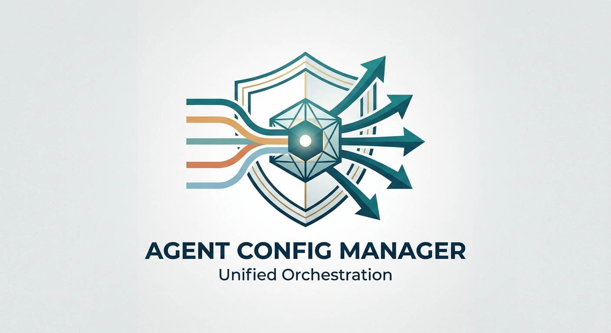
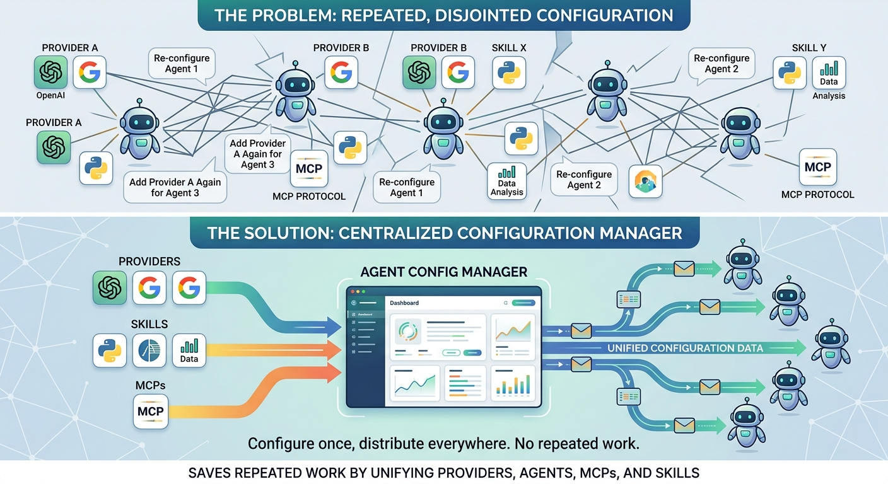

<div align="center">

# 🚀 Agent Config Manager

**Configure Once. Distribute Everywhere.**

*Stop copy-pasting the same provider config into 10 different agent CLIs. Use Agent Config Manager.*

[](https://github.com/alihusains/AIAgentConfigManager)
[](./LICENSE)
[](https://github.com/alihusains/AIAgentConfigManager)

**macOS • Linux • Windows**



</div>

---

## 😩 The Problem (You Know This One)

You manage 5+ AI agent CLIs: Claude, Cursor, Continue, Cline, Aider, Pi, Gemini, and more.

Every single one needs the same things:
- API keys from OpenAI, Anthropic, Mistral, Groq...
- MCP servers for extended capabilities
- Skills and tools
- Environment variables

So what happens?

**You do this. Again. And again. And again.**

```
❌ New API key? Type it into 8 config files.
❌ New MCP server? Find each agent's MCP config, add it, verify syntax.
❌ New skill? Download it to 5 different agent folders.
❌ CLI tool outdated? Check each one individually.
❌ Agent update available? Can't tell which ones.
```

**The Math Kills You**

One small change across 8 agents = **80+ minutes of manual work**. Do this once a week? That's 10 lost workdays per year. Just copy-pasting.

> "Why isn't there a dashboard for this?" — You, frustrated at 11 PM.

---

## ✨ The Solution (Dead Simple)

**Add it once. Click to distribute. Done.**

```
Add Provider → Choose Agents → Click Deploy → ✅ Synced to all agents
```

That's the entire product.

### What Happens Behind the Scenes

Agent Config Manager writes the provider to each agent's native config format. No lock-in. No proprietary formats. Claude gets it in Claude's format. Cursor gets it in Cursor's format. The agent CLI itself has no idea the config came from a dashboard—it just works.

---

## 🎯 What It Actually Does

### 1. **Provider Management** — One Place for All Your API Keys
- Add any LLM provider once (OpenAI, Anthropic, Groq, Mistral, OpenRouter, and 60+ more)
- Assign to any agent with one click
- Verify the API key works before pushing
- Provider goes into each agent's native config

### 2. **MCP Servers** — Extend Capabilities Instantly
- Register an MCP server once
- Turn it on for specific agents with a toggle
- All agents get seamless access to extended tools
- No manual JSON editing

### 3. **Skills & Tools** — Central Discovery + Installation
- Browse 50+ available CLI tools (Node, Python, Rust, Docker, etc.)
- See what's installed on your machine
- One-click install missing tools
- One-click update outdated tools

### 4. **AI Agent Discovery** — Stay Current
- Browse 30+ AI agent CLIs (Claude, Cursor, Continue, Windsurf, Pi, Gemini, and more)
- See installation instructions per platform
- Discover new agents as they come to market
- Never fall behind

### 5. **Agent Updates** — Check and Update All at Once
- Check for updates across all installed agents (one click)
- See which agents have updates available
- Update all at once or pick specific ones
- Stay secure, stay current

### 6. **CLI Tools Inventory** — What's Installed? What's Outdated?
- See every CLI tool on your machine (npm, pnpm, bun, git, docker, etc.)
- Green checkmark = up to date
- Yellow flag = update available
- One-click update all

### 7. **Environment Variables** — No More File Hunting
- View all env vars in one place
- Edit safely from the dashboard
- Hidden by default (show only when needed)
- No more digging through .env files

### 8. **Per-Agent Control** — See Everything, Edit Everything
- View each agent's full config
- Open its folder with one click
- Edit config directly in the browser
- Copy file paths instantly
- Detect configuration drift (when config changes outside the dashboard)

---

## ⏱️ Time Saved (Real Numbers)

| Task | Old Way | With ACM | You Save |
|------|---------|----------|----------|
| Add 1 provider to 5 agents | 25 min | 2 min | **23 min** |
| Update 10 CLI tools | 20 min | 30 sec | **19.5 min** |
| Manage 50 MCP servers | 2+ hours | 10 min | **1 hr 50 min** |
| Rotate credentials across 5 agents | 15 min | 5 min | **10 min** |
| **Your typical week** | **10+ hours** | **30 minutes** | **9.5 hours** |

**That's almost a full workday reclaimed. Every single week.**

---

## 🚀 Get Started in 3 Steps

### Step 1: Clone & Install
```bash
git clone https://github.com/alihusains/AIAgentConfigManager.git
cd AIAgentConfigManager
pnpm install
```

### Step 2: Start the Dashboard
```bash
pnpm start
```

### Step 3: Open in Your Browser
```
http://localhost:4321
```

Done. You now have a central hub for all your agent configs.

---

## 🎨 Visual: The Problem & Solution



*Left side: Before. Manually configure the same provider in 8 different agents.*
*Right side: After. Add once, deploy to all.*

---

## 💚 Supported Providers (60+)

### OpenAI-Compatible
OpenAI, OpenRouter, Mistral, Groq, Together AI, Replicate, HuggingFace, Ollama, LM Studio

### Anthropic-Compatible
Anthropic (Claude)

### Native Protocols
Google Gemini, Cohere, AWS Bedrock, Azure OpenAI, and 50+ more

### Self-Hosted
Ollama, Llama Factory, TGI, LocalAI, llama.cpp, and more

**All 60+ providers are discoverable and searchable in the dashboard.**

---

## 🤖 Supported Agent CLIs (30+)

**Built-in Support For:**
Claude Code, Cursor, Continue, Cline, Aider, Pi, Gemini CLI, Windsurf, Zed, GitHub Copilot CLI, and 20+ more.

**Auto-Detection:**
If you have an agent CLI installed, ACM finds it automatically—even if it's not in the pre-built list.

---

## 🛠️ CLI Tools Discovery (50+)

**Development:**
Node, npm, pnpm, yarn, bun, git, python, rust, cargo, go, docker, vim, neovim

**Cloud & DevOps:**
aws-cli, gcloud, kubectl, terraform, helm, ansible

**AI/ML:**
ollama, jupyter, huggingface-cli, conda

**Utilities:**
curl, wget, tmux, ripgrep, fzf, jq, ffmpeg, imagemagick, and more

**All tools show:**
- What you have installed
- What version you're running
- If updates are available
- How to install or update with one click

---

## 🔒 Security & Privacy First

✅ **API keys stored in OS keychain** — macOS, Linux, Windows all supported  
✅ **Local-first architecture** — Everything runs on your machine  
✅ **Secrets redacted by default** — API keys hidden until you click "reveal"  
✅ **Zero telemetry** — We don't track anything  
✅ **Open source (MIT)** — Read the code, audit it, trust it  

---

## 📊 At a Glance

| Feature | Status |
|---------|--------|
| Provider Management | ✅ Full support (60+ providers) |
| MCP Servers | ✅ Full support |
| Skills Discovery | ✅ Full support |
| CLI Tools Inventory | ✅ Full support |
| Agent Discovery | ✅ 38 agents cataloged + live GitHub star rankings |
| Live Star Rankings | ✅ Updated hourly, sort by popularity/trending |
| Dark Mode | ✅ Full support |
| Configuration Drift Detection | ✅ Real-time detection |
| Environment Variables | ✅ Safe viewing & editing |
| Mobile Responsive | ✅ Works on tablet |
| Open Source | ✅ MIT Licensed |

---

## 🧠 How It Works (30 Seconds)

1. **You add a provider** — Name, API key, models
2. **ACM verifies the key** — Tests it against the provider's API
3. **You choose agents** — Toggle which agents get this provider
4. **ACM deploys** — Writes the config in each agent's native format
5. **Agents pick it up** — Next time they run, they see the new provider

No restarts needed. No manual file editing. No copy-paste.

---

## 🤝 Contributing & Support

### Found a Bug?
[Open an issue on GitHub](https://github.com/alihusains/AIAgentConfigManager/issues) with:
- Your OS (macOS, Linux, Windows)
- Your Node version (`node --version`)
- Steps to reproduce
- Screenshots (if visual)

### Have a Feature Idea?
[Start a discussion on GitHub](https://github.com/alihusains/AIAgentConfigManager/discussions) — we read every suggestion.

### Want to Code?
1. Fork the repo
2. Create a branch: `git checkout -b feature/my-feature`
3. Commit: `git commit -m 'Add my feature'`
4. Push: `git push origin feature/my-feature`
5. Open a Pull Request

**All contributions welcome.** Code, docs, UX ideas, bug reports—this project grows because people like you show up.

---

## 📚 Documentation & Community

- 📖 [Full Docs](https://github.com/alihusains/AIAgentConfigManager/wiki)
- 💬 [Discussions](https://github.com/alihusains/AIAgentConfigManager/discussions)
- 🐛 [Issues](https://github.com/alihusains/AIAgentConfigManager/issues)
- ⭐ [Star the Repo](https://github.com/alihusains/AIAgentConfigManager)

---

## 💭 What Users Say

> "This tool saved me 10+ hours a week. Absolutely game-changing."  
> — Senior AI Engineer

> "Finally, a sane way to manage multiple agents. Why didn't this exist sooner?"  
> — ML Research Lead

> "Beautiful UI and actually intuitive. Highly recommend."  
> — Full-Stack Developer

---

## 🚀 What's Coming Next

- ☁️ Optional cloud sync across your devices
- 👥 Team collaboration with shared provider libraries
- 🪝 Webhooks to trigger automation on config changes
- 🔌 REST API for programmatic management
- 📱 Mobile app for on-the-go config management
- 🔧 Plugin system for custom agent adapters

---

## 📝 License

MIT License — free for personal and commercial use.

[View Full License](./LICENSE)

---

<div align="center">

## Ready to Stop Repeating Configuration Work?

### ⭐ Star us on GitHub • 🚀 Install in 3 steps • 💬 Join the community

**Let's make AI agent management simple. Together.**

Made with ❤️ by the Agent Config Manager team

[⭐ Star on GitHub](https://github.com/alihusains/AIAgentConfigManager) • [🐛 Report Issues](https://github.com/alihusains/AIAgentConfigManager/issues) • [💬 Discuss](https://github.com/alihusains/AIAgentConfigManager/discussions)

</div>
